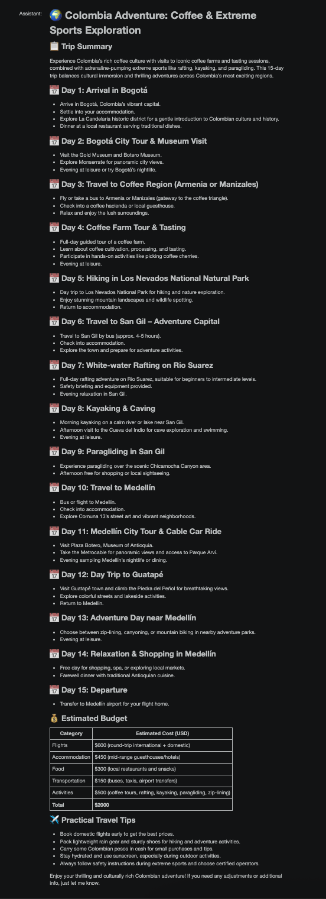

# ✈️ AI Travel Advisor

**Ironhack AI Engineering Bootcamp**

Mini Project – Conversational AI using the OpenAI API and Panel.

---

## 📖 Project Overview

The goal of this project was to build an AI-powered **Travel Advisor** capable of holding a natural conversation with users and generating personalized travel itineraries.

The application uses the **OpenAI API** together with a conversation history (`context`) to maintain memory throughout the conversation. Instead of generating an itinerary immediately, the assistant asks follow-up questions until it has enough information to create a personalized travel plan.

The chatbot collects:

- 🌍 Destination
- 📅 Trip duration
- 💰 Budget
- 👥 Number of travelers
- ❤️ Travel interests

Once all the required information has been collected, the assistant generates:

- 🗺️ Trip Title
- 📝 Trip Summary
- 📅 Day-by-day Itinerary
- 💰 Estimated Budget
- ✈️ Practical Travel Tips

---

## 💬 Example Conversation

### User

> Colombia, 15 days, budget **$2000**, 2 travelers, coffee and extreme sports.

### Assistant

> Just to confirm, by **coffee** do you mean exploring coffee regions and coffee culture? For extreme sports, are you interested in activities like paragliding, rafting, or something else?

### User

> Both tasting coffee and exploring the culture, including visiting a coffee farm.

### Assistant

> Great! For extreme sports, do you have any specific activities in mind, such as rafting, kayaking, or paragliding?

### User

> Rafting, kayaking down rivers, paragliding and similar activities.

After gathering enough information, the assistant generated a complete **15-day itinerary**, including:

- 🌍 Trip Title
- 📋 Trip Summary
- 📅 Daily itinerary
- 💰 Budget estimation
- ✈️ Practical travel tips

This demonstrates that the chatbot correctly maintained the conversation context and only generated the itinerary after collecting all the required information.

---

## 🚀 Bonus Features

### ✅ Structured Markdown Output

The itinerary is generated using a structured **Markdown** format with:

- Titles
- Headings
- Bullet points
- Budget table
- Travel tips

This makes the output easy to read within the Panel interface.

### ✅ Conversation Memory

The chatbot stores every interaction inside the `context` list.

This allows the assistant to:

- Remember previous answers.
- Avoid asking the same questions twice.
- Ask only for missing information.
- Generate personalized itineraries.

### ✅ Prompt Engineering

The system prompt was designed to:

- Ask only the necessary questions.
- Request clarification when information is ambiguous.
- Avoid generating an itinerary too early.
- Produce consistent and organized responses.

---

## ⚠️ Variations That Didn't Work Well

Several versions of the system prompt were tested during development.

The initial version of the prompt was too general. As a result, the assistant sometimes generated an itinerary before collecting enough information from the user.

After refining the prompt with instructions such as:

> "Ask only for missing information."

and

> "If the user provides conflicting or ambiguous information, ask for clarification before generating the itinerary."

the conversations became much more natural and the generated itineraries were significantly more personalized.

Another observation was that, when the prompt lacked clear constraints, the assistant occasionally assumed user preferences instead of asking follow-up questions.

Adding explicit instructions reduced these assumptions considerably.

---

## 📚 What I Learned

This project demonstrated that building an AI application involves much more than simply calling an LLM.

The quality of the responses depends heavily on:

- Prompt engineering
- Conversation memory
- Well-defined system instructions

I also learned the importance of:

- Designing effective system prompts.
- Maintaining conversation history.
- Asking follow-up questions instead of making assumptions.
- Structuring responses in a consistent format.

One of the most important concepts I learned is that **Large Language Models do not remember previous conversations automatically**. The application must explicitly send the conversation history (`context`) with every API request.

---

## ⚡ Limitations

The chatbot generated realistic and well-structured itineraries. However, it has some limitations.

The estimated budget is based on general travel costs and should be considered an approximation.

Because the application does not use live web search or external APIs, it cannot provide:

- Real-time flight prices
- Current hotel availability
- Live weather information
- Updated activity prices

These values may vary depending on the season and booking availability.

Future improvements could include integrating external APIs to provide real-time travel information.

---

## 🛠️ Technologies Used

- Python
- OpenAI API
- GPT Model
- Panel
- Markdown
- Prompt Engineering

---

## 📌 Conclusion

This project successfully demonstrates how conversational AI can be used to build a personalized travel planning assistant.

By combining prompt engineering, conversation memory, and the OpenAI API, the chatbot is capable of collecting user preferences through natural dialogue and generating detailed travel itineraries tailored to each traveler. 

---

## 📸 Screenshots

### AI Travel Advisor Interface

*Figure 1. Conversation with the AI Travel Advisor showing the personalized itinerary generation.*